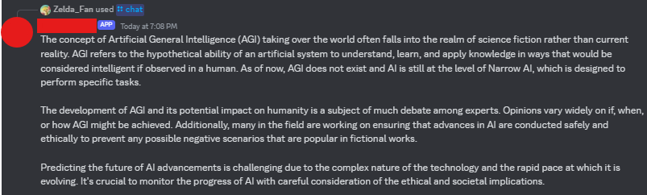
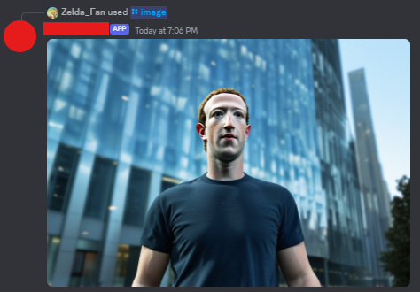
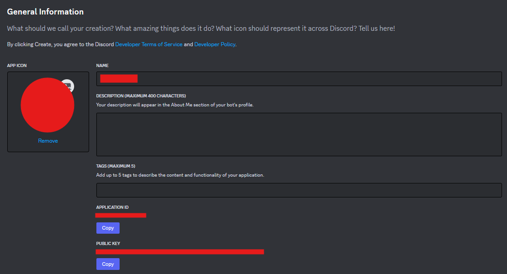
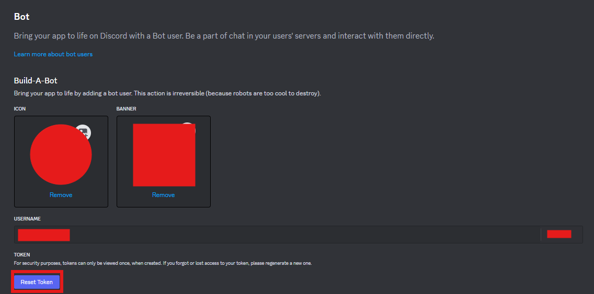

# ChatGPT HTTP Discord User App

This is a Discord user app which can be added to yourself.
It uses a http server instead of the traditional websocket.
You can chat with ChatGPT and generate images.




## Requirements
- a domain (probably optional if you use the IP to give to Discord to post the interactions)
- a server with NodeJS >= 20.x.x
- a discord app

> [!NOTE]
> Currently hosting this bot via cloudflare workers or on vercel is not supported

## Setting it up


### 1. Cloning the repository and setting up the files

```console
git clone https://github.com/ZeldaFan0225/ChatGPT-Stateless-Discord.git
cd ChatGPT-Stateless-Discord
```

Rename `template.env` to `.env` and `template.config.json` to `config.json`.

### 2. Setting up a [Discord App](https://discord.com/developers/applications)

1) Click "New Application"
2) Give it a nice name, agree to the terms and create the app
3) Under "Bot" uncheck "Public Bot" if you want this Bot to be private
4) Head over to "Installation"
5) Uncheck "Guild Install" and check "User Install"
6) Under "Install Link" select "Discord Provided Link", open the now shown link in your browser, authorize it and set it back to "None"

### 3. Locating the credentials you need

If you have already taken a look at the [template.env](https://github.com/ZeldaFan0225/ChatGPT-Stateless-Discord/blob/main/template.env) you may have noticed a few blank fields. We will fill in the following ones now:

- `APPLICATION_PUBLIC_KEY`
- `CLIENT_ID`
- `BOT_TOKEN`

The `CLIENT_ID` (Application ID) and `APPLICATION_PUBLIC_KEY` (Public Key) can be found on the main page ("General Information") right below the name and descrioption of the app.



The `BOT_TOKEN` can be located under "Bot". You need to reset the token to retrieve it.



### 4. The rest of the .env

- `MODE` should be set to PROD unless you want to develop on this app. It basically controls what host the app launches at
- `PORT` set this to any unused port on your server which you open to the outside so the bot can receive this 
- `OPENAI_TOKEN` go through [OpenAI's quick start guide](https://platform.openai.com/docs/quickstart) until you have a token and put it in here
- `PERPLEXITY_TOKEN` is an example for a OpenAI compatible service. You can delete this if you don't want to use it
- `STABILITY_AI_TOKEN` if you want to generate images go through [Stability AI's quick start guide](https://platform.stability.ai/docs/getting-started) until you have a token and put it in here. (You can leave it blank but when you try to generate images it won't work)

### 5. Changing the config

This is the part where you can get ✨ creative ✨.
You should:
- set up some creative custom system instructions to use under `selectable_system_instructions` following the structure of the preexisting examples
- add the models you would like to use under `models`. Simply copy one of the preexisting examples and modify it for your needs.

One last thing, `default_model` should be a key of `models` and `default_system_instruction` should be in `selectable_system_instructions`

### 6. Actually starting the app

I am no professional but I use the following commands to get this app started. I use pm2 to manage the app.
(In the `ChatGPT-Stateless-Discord` directory)
```console
npm i
npx tsc -p .
pm2 start ./
```

You might also want to set up a reverse proxy like nginx to get the requests to this app.

### 7. Finishing up the setup

The last step you need to do is take the IP or url (if you chose to use a domain with this) of your server and add it to your Discord app in the "General Information" tab under "Interactions Endpoint Url"

## Contributions

I am currently not looking for any contributions but you are welcome to fork this repository.

## Issues

If you have any issues setting this bot up you can [open an issue](https://github.com/ZeldaFan0225/ChatGPT-Stateless-Discord/issues/new) in this repository but I don't guarantee an answer.
